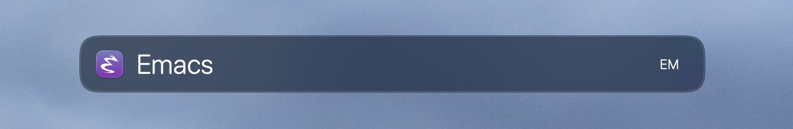

# Get Recently Opened Files with Emacs for LaunchBar

This repository provides an action for [LaunchBar](https://www.obdev.at/products/launchbar/actions.html) for accessing recent documents opened with [Emacs](https://www.gnu.org/software/emacs/). The action reads the Emacs `recentf` list to provide quick access to recently opened files directly from LaunchBar.



## Contents

This repository includes the following components:

- **Recent Emacs Files.lbaction**: LaunchBar action to enable direct access to recent Emacs documents.

## Prerequisites

Emacs must have `recentf-mode` enabled. Add the following to your Emacs configuration if it is not already enabled:

```elisp
(recentf-mode 1)
```

### Recentf file location

The action expects the recentf file at `~/.cache/emacs/recentf.eld`. If your Emacs uses a different location, you have two options:

1. **Set the path in Emacs** by adding this to your configuration:
   ```elisp
   (setq recentf-save-file "~/.cache/emacs/recentf.eld")
   ```

2. **Edit the script** in LaunchBar's Action Editor: right-click the action in LaunchBar, select *Edit in Action Editor*, and change the `RECENTF_PATH` variable in `default.py` to match your setup.

## Installation

### Option 1: Manual Installation

1. **Download** [Recent-Emacs-Files.lbaction.zip](https://github.com/alberti42/List-Emacs-Recentf-From-LaunchBar/releases/latest/download/Recent-Emacs-Files.lbaction.zip) from the latest release.
2. **Extract** the zip to get `Recent Emacs Files.lbaction`.
3. Place the `.lbaction` file into your LaunchBar Actions folder:
   ```
   ~/Library/Application Support/LaunchBar/Actions
   ```

4. **Restart LaunchBar** to load the new action.

### Option 2: Automatic Installation

Alternatively, you can simply double-click the `.lbaction` file. This will automatically install the action in LaunchBar.

## Usage

- Activate LaunchBar and type the name of Emacs.
- Press space to display the recent documents directly from LaunchBar.

## Author

- **Author:** Andrea Alberti
- **GitHub Profile:** [alberti42](https://github.com/alberti42)

Feel free to contribute to the development of this plugin or report any issues in the [GitHub repository](https://github.com/alberti42/List-Emacs-Recentf-From-LaunchBar/issues).
